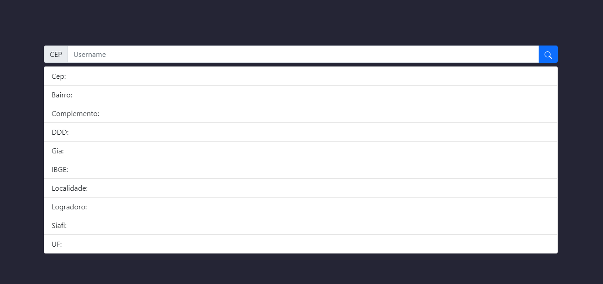

## PROJETO PARA COMSUMIR API VIACEP

Ferramentas utilizadas:
1. React.Js
2. Express.js
3. MongoDB

### INICIAR BACKEND

Abrir terminal

`cd backend`

editar `.env.example` para criar `.env`

`node index.js`

### INICIAR FRONTEND

Abrir terminal

`cd frontend`

editar `.env.example` para criar `.env`

`node npm run dev`

Imagem do frontend funcionando.